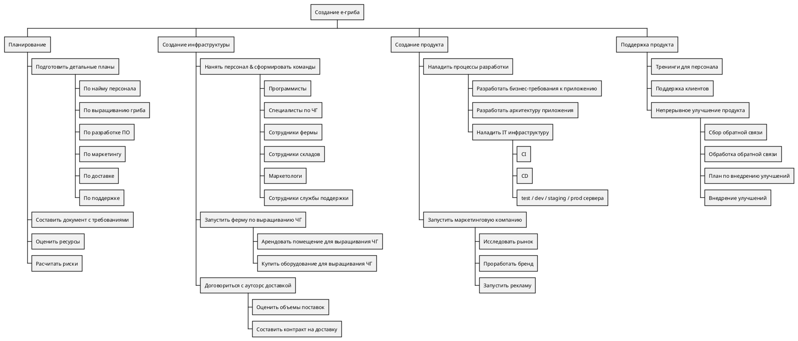

```plantuml

@startwbs
* Создание e-гриба

** Планирование
*** Подготовить детальные планы
**** По найму персонала
**** По выращиванию гриба
**** По разработке ПО
**** По маркетингу
**** По доставке
**** По поддержке
*** Составить документ с требованиями
*** Оценить ресурсы
*** Расчитать риски

** Создание инфраструктуры
*** Нанять персонал & сформировать команды
**** Программисты
**** Специалисты по ЧГ
**** Сотрудники фермы
**** Сотрудники складов
**** Маркетологи
**** Сотрудники службы поддержки
*** Запустить ферму по выращиванию ЧГ
**** Арендовать помещение для выращивания ЧГ
**** Купить оборудование для выращивания ЧГ
*** Договориться с аутсорс доставкой
**** Оценить объемы поставок
**** Составить контракт на доставку

** Создание продукта
*** Наладить процессы разработки
**** Разработать бизнес-требования к приложению
**** Разработать архитектуру приложения
**** Наладить IT инфраструктуру
***** CI
***** CD
***** test / dev / staging / prod сервера
*** Запустить маркетинговую компанию
**** Исследовать рынок
**** Проработать бренд
**** Запустить рекламу

** Поддержка продукта
*** Тренинги для персонала
*** Поддержка клиентов
*** Непрерывное улучшение продукта
**** Сбор обратной связи
**** Обработка обратной связи
**** План по внедрению улучшений
**** Внедрение улучшений

@endwbs

```
